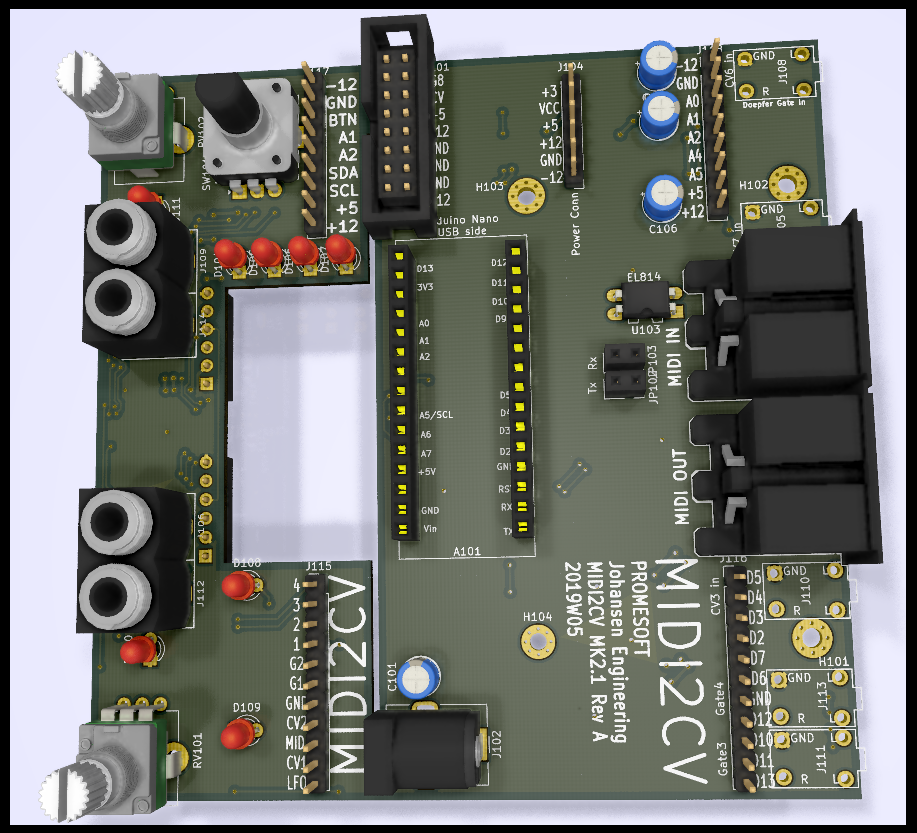
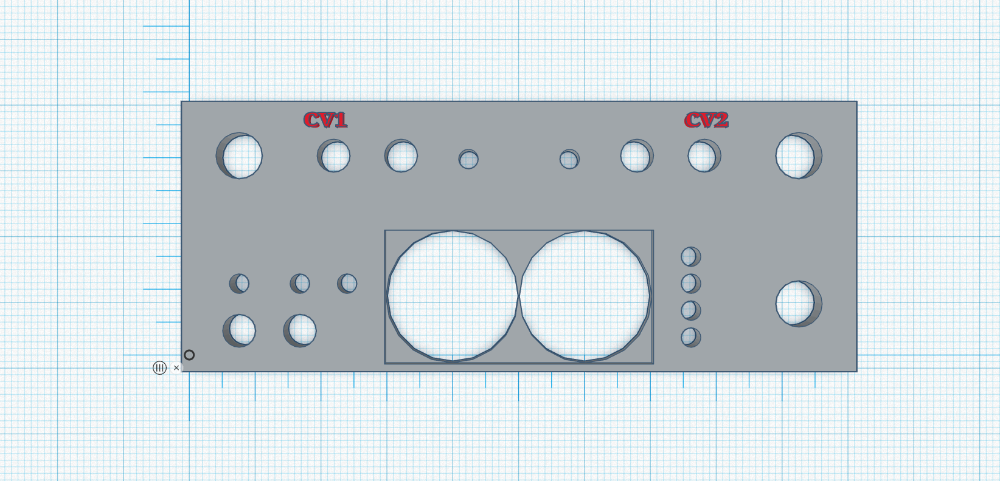

# Kicad-MidiToCV
Midi to CV in Eurorack 

# MK2 Design
## Status - New project started
### Issues and Notes
 * Note - the 4 value LED's are routed across the front board next to analogue and gate signals - so care should be taken when deciding between constant power or PWM control of brightness. The other LED's are not considered as vital as they will normally be lit when config is changed.
### Errata
### Workarounds

## Base Construction
### Arduino base board 
 - Arduino Nano
 - MIDI IN/OUT connectors
 - CV 1 and CV 2 as Mini Jacks (PJ-301) with variable x2-x3 amplification and 1st ord LP filter
 - Gate 1 and Gate 2 as Mini Jacks (PJ-301) 5V
 - Gate 3 and Gate 4 as Mini Jacks (PJ-321) with fixed x2 amplification and sallen-key LP 2nd order filter
 - Board connector 9pin and 11pin from base board to front board
 - 16pin Europower connector
 - Barreljack for 7-12V digital Pwr
 

## Vital Components
 - Arduino Nano - where the magic lives (remember to socket it to be able to reprogram it - two jumpers are in place for Rx/Tx so socket may be avoided)
 - Jack connectors: PJ-321 for the base board and PJ-301 for the front board (important for the footprint)
 - ALPS EC-11 Encoder (important for the footprint and 3D alignment)
 - ALPS RV09 horisontal potentiometer (important for the footprint and for variable CV out - can be omitted if this is not needed)
 - MCP4825 module - if chosen (important for CV out function - footprint needs to match)
 - TL072 or similar dual op amp
 
### Mechanical

The construction is still split in two - but the MK2 design relies on a base board that is 90degrees to the face plate (like the MK1) and a connector board that is 10mm behind the faceplate 90 degrees angle to the base board.

.png)
-----------------------------------------------------

# MK1 Design
## Status - Rev B - Ongoing PCB layout and Sch update

## Status - Rev A Mounted - Midi code in progress
### Issues and Notes
Please note that the PIN1 and PIN2 are GATE. This is note described clearly in http://www.doepfer.de/a100_man/a100t_e.htm and needs to be noted when soldering the IDC header or when cabling if a Pin header has been mounted.
 * The two pots on the breakout board are too close for adding a knob
 * The orientation of the pinheader for the MCP4725 module - if mounted incorrectly the magic smoke disappears
 * 0R could be replaced with SMD jumpers
 * Consider a 200 mA fuse for Vin and 50mA for +5V pwr
 * The mounting hole that is off center is not matching both boards
### Errata
 * Footprint of PJ-321 has too small drill holes (1mm) - major
 * Footprint of PJ-321 is too narrow in the rear end :) - minor issue
 * Midi out circuit is WRONG - Major
### Workarounds
* Midi out not working - PCB workaround mod partially possible  
 * --Remove GND around DIN pin 5 (bottom copper side)
 * --Cut GND track to DIN pin 5 (top copper side)
 * --Remove Q1, R6, R9
 * --Connect 220R THT to base pad on Q1
 * --Connect C and E on Q1
 * --Add GND wire to pin2 of MIDI out DIN
## Physical Construction
 - 100x100mm
 - Separate unit with no alteration
 - Optional split in 2 for eurorack mount mirrored config

## Vital Components
 - Arduino Nano - where the magic lives (remember to socket it to be able to reprogram it)
 - Jack connectors: PJ-321 (important for the footprint)
 - KY-40 Encoder module (important for the pullup, footprint and 3D alignment)
 - MCP4825 module - if chosen (important for CV out function - footprint needs to match)
 If these are chosen the last two CV jacks should be ommitted.
 - MCP4728 chip - if chosen (important for the last 2 CV out)

## MIDI Board Features
### Single board - MIDI I/O and MIDI to CV
The board can be used as is for a prototype development of MIDI to CV
### Split board Eurorack - MIDI I/O and MIDI to CV
The board can be devided in two and combined front to front with spacers for a MIDI to CV eurorack module.
### Base board Eurorack - MIDI I/O
If only MIDI features are required the base board can work without the IO section.

## Generic Board Features
### Split board Options
The main board (with the arduino) has a couple of headers that can be connected to a different interface board using I2C, Analogue Inputs and Digital I/O.
### Non MIDI board
The MIDI components can be omitted if the features does not require MIDI, like an LFO, VCO or ADSR circuit.

## Base Construction
Arduino Nano based Controller and MIDI decoder.

### MIDI In
MIDI In through a PC814 (or optional PC817) Optocoupler and into the RX pin on the Arduino

### Midi Out
Optional expansion

### Gate
Gate pins from Arduino

## CV Out
I2C Dac with 2 options
### I2C Dac - Option 1 - Two Single channel DAC
2x MCP4725 DAC 
### I2C Dac - Option 2 - One 4 channel DAC
1x MCP4728

# RevB

# RevA

